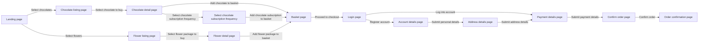

# Example Mermaid Export

The export from the tool can be embedded in Markdown and rendered in Github

```mermaid
flowchart LR
landing-page["Landing page"] -- "Select chocolates" --> chocolate-listing-page["Chocolate listing page"]
chocolate-listing-page["Chocolate listing page"] -- "Select chocolate to buy" --> chocolate-detail-page["Chocolate detail page"]
chocolate-detail-page["Chocolate detail page"] -- "Add chocolate to basket" --> basket-page["Basket page"]
basket-page["Basket page"] -- "Proceed to checkout" --> login-page["Login page"]
login-page["Login page"] -- "Log into account" --> payment-details-page["Payment details page"]
payment-details-page["Payment details page"] -- "Submit payment details" --> confirm-order-page["Confirm order page"]
confirm-order-page["Confirm order page"] -- "Confirm order" --> order-confirmation-page["Order confirmation page"]
landing-page["Landing page"] -- "Select flowers" --> flower-listing-page["Flower listing page"]
flower-listing-page["Flower listing page"] -- "Select flower package to buy" --> flower-detail-page["Flower detail page"]
flower-detail-page["Flower detail page"] -- "Add flower package to basket" --> basket-page["Basket page"]
chocolate-detail-page["Chocolate detail page"] -- "Select chocolate subscription frequency" --> post-select-chocolate-subscription-frequency["Select chocolate subscription frequency"]
post-select-chocolate-subscription-frequency["Select chocolate subscription frequency"] -- "Add chocolate subscription to basket" --> basket-page["Basket page"]
login-page["Login page"] -- "Register account" --> account-details-page["Account details page"]
account-details-page["Account details page"] -- "Submit personal details" --> address-details-page["Address details page"]
address-details-page["Address details page"] -- "Submit address details" --> payment-details-page["Payment details page"]
```